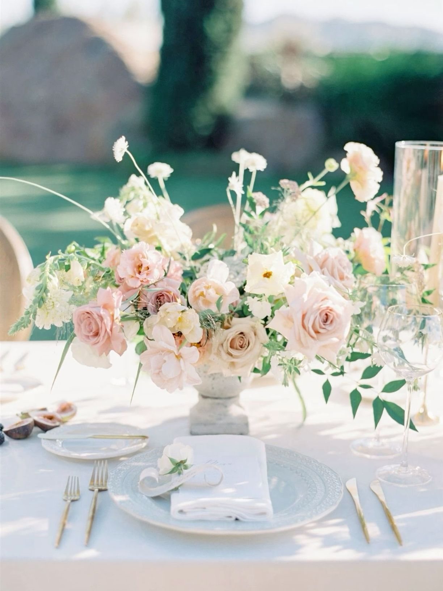

<html> 
  <head>
  <title> Floral Planner </title>
      
    <link href="https://fonts.googleapis.com/css2?family=Poppins:wght@300;500;700&display=swap" rel="stylesheet">
    <link href="https://fonts.googleapis.com/css2?family=Allura&display=swap" rel="stylesheet">

  </head>
  <body>
    <h1> The Floral Planner </h1> 
    <h2> Looking to start a new project? </h2>
    <button type="button"> Start Project! </button> 
    
  </body>
</html>
